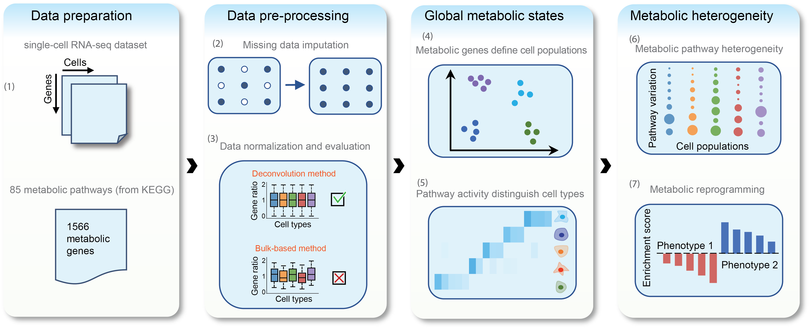

Metabolic landscape of single cells in the tumor microenvironment
============
Introduction
------------
This pipeline is responsible for analyzing metabolic gene expression profiles in the tumor microenvironment using single-cell RNA sequencing data. 



There are 7 main steps involved in data processing which organized in different folders.

Requirements
------------
The required R packages for this pipeline can be installed by:

``` bash
Rscript install_requiredPackages.R 
```
Download and read the datasets
-----------------------------
``` bash
cd "1-ReadData"
bash download_dataset.sh
Rscript readData_head_neck.R
Rscript readData_melanoma.R
cd ../
```
The gene expression profiles and the annotations of the cell types will be stored as R objects.

Imputation of the missig values
-------------------------------
``` bash
cd "2-Imputation"
Rscript impute_tpm.R melanoma 
Rscript impute_tpm.R head_neck
cd ../
```
This step uses the ["scImpute"](https://github.com/Vivianstats/scImpute) package to impute the missing values in gene expression profiles. 

Normalization and evaluation of different normalization methods 
---------------------------------------------------------------
``` bash
cd "3-Normalization"
Rscript normalization.R melanoma
Rscript normalization.R head_neck
cd ../
```
Four commonly used data normalization methods are applied on each dataset. The distribution of relative gene expression of each cell type will be ploted to evaluate and select the best normalization method.

Landscape of the metabolic gene expression profile
--------------------------------------------------
``` bash
cd "4-Clustering"
Rscript metabolic_landscape.R melanoma
Rscript metabolic_landscape.R head_neck
Rscript inter_tumor_distance.R melanoma
Rscript inter_tumor_distance.R head_neck
cd ../
```
The t-SNE algorithm will be performed in this step for visualizing metabolic gene expression in millions of cells (The result may be slightly different with the figure in manuscript due to the random initialization). The spearman correlation matrix will aslo be generated to show the inter-tumor heterogeneity using the metabolic genes.

Metabolic pathway activities in different cell types
--------------------------
``` bash
cd 5-PathwayActivity
Rscript scRNA_pathway_activity.R melanoma
Rscript scRNA_pathway_activity.R head_neck
Rscript TCGA_pathway_activity.R
cd ..
```
This step will calculate the metabolic pathway activities for different single cell populations or bulk tumor/normal samples. The scatter plot will show the discrepancy of pathway activities between single malignant cells and bulk tumors. The violin plot will show the distribution of metabolic pathway activities in single cell populations or bulk tumor/normal samples.

*The bulk RNA-seq data was downloaded from TCGA website, please see the instruction of data downloading and preprocessing in Data/TCGA/README.md* 

Metabolic pathway heterogeneity
-------------------------------
``` bash
cd 6-PathwayHeterogeneity
Rscript intra_malignant_heterogeneity.R melanoma
Rscript intra_malignant_heterogeneity.R head_neck
Rscript intra_non-malignant_heterogeneity.R melanoma
Rscript intra_non-malignant_heterogeneity.R head_neck
Rscript OXPHOS_Glycolysis_Hypoxia_Correlation_plot.R melanoma
Rscript OXPHOS_Glycolysis_Hypoxia_Correlation_plot.R head_neck
Rscript OXPHOS_Glycolysis_Hypoxia_Correlation_plot-CCLE.R
Rscirpt GeneSignature-of-Low_OXPHOS_Glycolysis_Hypoxia.R melanoma
Rscript GeneSignature-of-Low_OXPHOS_Glycolysis_Hypoxia.R head_neck
cd ..
```
In this step, the PCA and GSEA analysis will be performed to investigate the metabolic pathway heterogeneity across single cells in malignant and non-malignant cell populations. The scatter plots will be performed to compare activities of OXPHOS, glycolysis and response to hypoxia in single malignant cells and cultured cell lines from CCLE database. The gene signatures in single cells with low OXPHOS/glycolysis/hypoxia activity will be identified and stored as the text files, which can be used as the input of GO analysis on the website: http://metascape.org

Metabolic features of nonmalignant cell subtypes
-----------------------------------
``` bash
cd 7-MetabolicFeatures
Rscript non-malignant_subtype.R melanoma
Rscript non-malignant_subtype.R head_neck
cd ..
```
The metabolic features in different T-cell subtypes and fibroblast subtypes will be identified in this step. 

Contact
-------
zhengtao.xiao[at]xjtu.edu.cn
